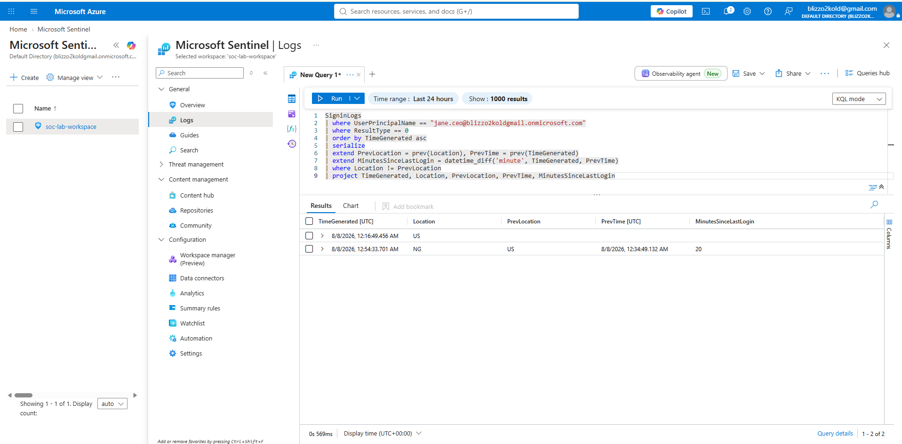
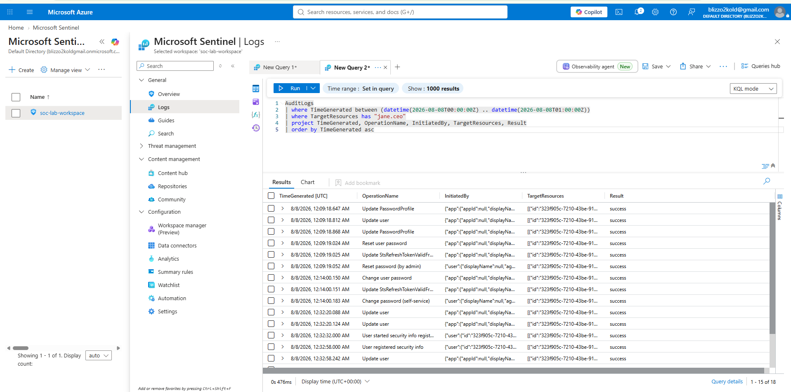
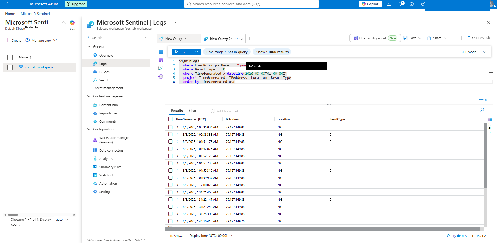
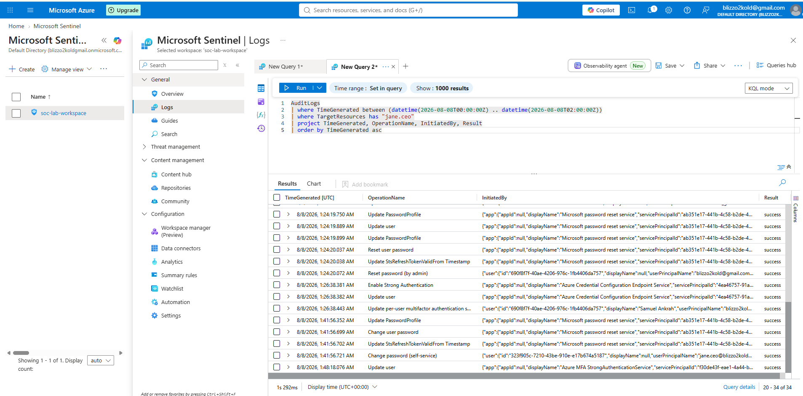
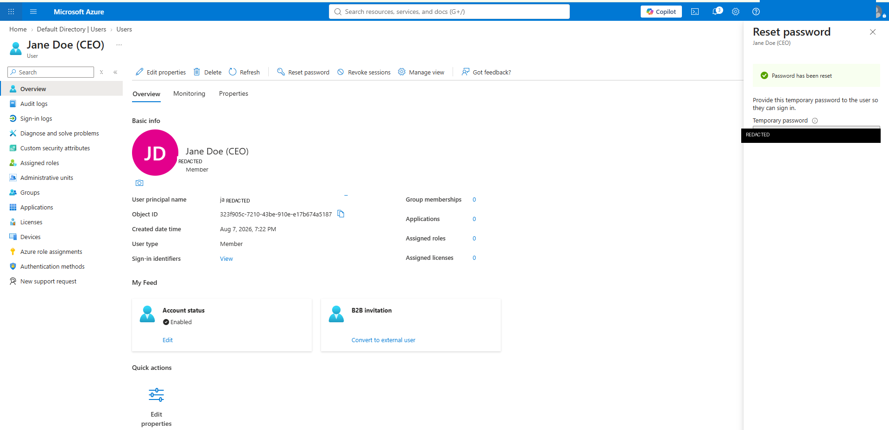
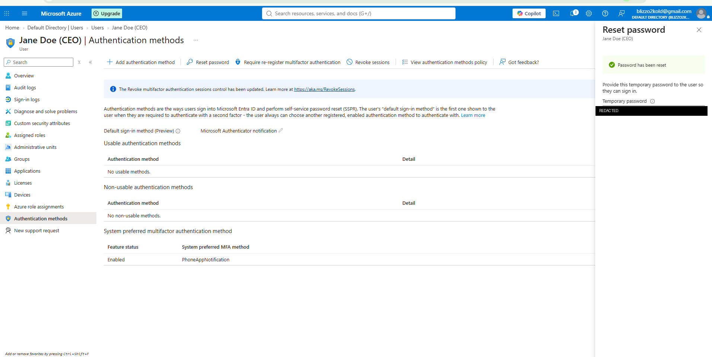

# Security Incident Report
### CEO Account Takeover Investigation — Impossible Travel Detection

| | |
|---|---|
| **Analyst** | Samuel Ankrah |
| **Severity** | 🔴 HIGH |
| **Platform** | Microsoft Sentinel / Microsoft Entra ID |
| **Status** | Contained & Remediated |
| **Affected Account** | jane.ceo@ (CEO) |
| **Date** | August 8, 2026 |

| 20 | 10–14 hrs | ~48 min | YES |
|---|---|---|---|
| Minutes Between Logins | Min. Travel Time Required | Session Duration (Nigeria) | Persistence Established |

---

## 1. Executive Summary

On August 8, 2026, Microsoft Sentinel log analysis identified a successful sign-in to the CEO account (`jane.ceo@blizzo2koldgmail.onmicrosoft.com`) from a Nigerian IP address occurring **20 minutes** after a successful sign-in from a United States IP address on the same account. Given that no legitimate mode of travel could cover the intervening distance in that window, this pattern is classified as **impossible travel** — a high-confidence indicator of account compromise (e.g., credential theft, session hijacking, or unauthorized proxy/VPN use).

Further investigation identified a second wave of activity: the Nigeria-based session remained active for approximately **48 minutes**, during which a **new authentication method was registered** on the account. This represents an attacker persistence technique — establishing an independent means of re-authenticating even if the original credentials are later reset — and elevated the incident from a single anomalous login to an **active account takeover with entrenchment**.

The account was contained in two stages: an initial session revocation and password reset, followed by a full remediation pass once persistence was identified — forcing complete re-registration of MFA, revoking all sessions a second time, and rotating credentials again. Multi-factor authentication, which was not enforced at the time of the initial compromise, has since been enabled on the account as a corrective control.

---

## 2. Scope & Methodology

Investigation was conducted using Microsoft Sentinel (SIEM) against a Microsoft Entra ID tenant, using the following data sources and techniques:

- **SigninLogs** — Entra ID authentication telemetry (IP address, geolocation, result codes, timestamps)
- **AuditLogs** — administrative and account-management actions (password resets, MFA registration)
- **KQL (Kusto Query Language)** — used to hunt, correlate, and calculate time deltas between geographically inconsistent logins
- **MITRE ATT&CK framework** — used to classify the technique observed

---

## 3. Detection

The following KQL query was used to identify successful sign-ins to the account, ordered chronologically, and to surface any pair of consecutive logins where the reported country changed:

```kql
SigninLogs
| where UserPrincipalName == "jane.ceo@blizzo2koldgmail.onmicrosoft.com"
| where ResultType == 0
| order by TimeGenerated asc
| serialize
| extend PrevLocation = prev(Location), PrevTime = prev(TimeGenerated)
| extend MinutesSinceLastLogin = datetime_diff('minute', TimeGenerated, PrevTime)
| where Location != PrevLocation
| project TimeGenerated, Location, PrevLocation, PrevTime, MinutesSinceLastLogin
```

**Result:** a successful sign-in from the United States at **12:34:49 AM** was followed by a successful sign-in from Nigeria (IP `79.127.149.88`) at **12:54:33 AM** — a gap of 20 minutes between two geographically distant, successful authentications on the same account.


*KQL query and results showing the 20-minute gap between the US and Nigeria sign-ins.*

---

## 4. Impossible Travel Analysis

A standard SOC heuristic for impossible travel compares the elapsed time between two sign-ins against the minimum physically possible travel time between the two reported locations.

| Factor | Value |
|---|---|
| First sign-in | United States — 12:34:49 AM UTC |
| Second sign-in | Nigeria (Lagos region) — 12:54:33 AM UTC |
| Elapsed time | **20 minutes** |
| Approx. distance | ~8,700 km (5,400 mi) |
| Fastest real-world travel time | 10–14 hours (commercial flight, excluding layovers/customs) |
| **Conclusion** | **Physically impossible — high-confidence compromise indicator** |

---

## 5. Investigation Timeline

AuditLogs were queried for all administrative actions targeting the account in the hour surrounding the incident, to determine whether the account was further tampered with or whether the anomaly was isolated to authentication alone.

```kql
AuditLogs
| where TimeGenerated between (datetime(2026-08-08T00:00:00Z) .. datetime(2026-08-08T01:00:00Z))
| where TargetResources has "jane.ceo"
| project TimeGenerated, OperationName, InitiatedBy, Result
| order by TimeGenerated asc
```

| Time (UTC) | Event | Actor | Assessment |
|---|---|---|---|
| 12:09:18 AM | Reset password (by admin) | IT Administrator | Legitimate |
| 12:14:00 AM | Change password (self-service) | jane.ceo@... | Legitimate |
| 12:32:32 AM | Security info registration started | jane.ceo@... | Legitimate |
| 12:33:09 AM | All required security info registered | jane.ceo@... | Legitimate |
| 12:34:49 AM | Successful sign-in — United States | jane.ceo@... | Baseline |
| **12:54:33 AM** | **Successful sign-in — Nigeria (IP 79.127.149.88)** | jane.ceo@... | 🔴 **ANOMALOUS** |
| **01:00–1:44 AM** | **23 additional successful sign-ins — Nigeria** | jane.ceo@... | 🔴 **ANOMALOUS** |
| **01:48:18 AM** | **New authentication method registered mid-session** | Azure MFA StrongAuthenticationService | 🔴 **PERSISTENCE** |


*AuditLogs showing the full sequence: password reset, MFA setup, and initial logins.*

**Key finding:** the Nigeria-origin session persisted for approximately 48 minutes (23 additional successful sign-ins from the same IP range), and at 1:48:18 AM a new authentication method was registered on the account mid-session. This is a materially more severe finding than the initial login alone — it indicates the actor attempted to establish independent, persistent access to the account rather than a single opportunistic authentication.


*Extended Nigeria-origin session — 23 additional successful sign-ins over ~48 minutes.*

---

## 6. Persistence Finding: Unauthorized MFA Registration

A defining characteristic of account takeover versus a one-off suspicious login is whether the actor takes steps to maintain access after the initial compromise. In this case, AuditLogs confirm that a new authentication method was registered on jane.ceo's account at **1:48:18 AM** — roughly 54 minutes into the Nigeria-origin session — initiated via the Azure MFA StrongAuthenticationService.

This technique, formally tracked as **MITRE ATT&CK T1098.005** (Account Manipulation: Device Registration), allows an attacker to retain sign-in capability even after the compromised password is rotated, since the newly registered method is independent of the original credential. In a production environment with real end-user hardware, this would typically surface as a second, distinct device entry (e.g., an unfamiliar phone model or OS) under the account's Authentication Methods — a high-priority indicator for analysts to flag and remove during triage.


*AuditLogs entry capturing the unauthorized MFA registration at 1:48:18 AM, initiated by the Azure MFA StrongAuthenticationService.*

Remediation required a more thorough response than the initial containment: rather than simply resetting the password, the account's authentication methods were fully wiped and required re-registration from a verified, trusted state before regaining usable sign-in capability.

---

## 7. MITRE ATT&CK Mapping

| Tactic | Technique |
|---|---|
| Initial Access | T1078 — Valid Accounts |
| Credential Access | T1539 — Steal Web Session Cookie (suspected vector) |
| Defense Evasion | T1090 — Proxy (use of infrastructure to mask true origin) |
| Persistence | T1098.005 — Account Manipulation: Device Registration |

---

## 8. Containment & Remediation Actions Taken

Containment was performed in two passes as the scope of the incident became clearer.

**Initial containment** (following impossible travel detection):
- Revoked all active sessions on the affected account, invalidating any tokens obtained from the anomalous login.
- Reset the account password, issuing new credentials.
- Enforced multi-factor authentication (MFA) on the account, closing the gap that allowed sign-in without a second verification factor.

**Escalated containment** (following persistence finding):
- Identified the unauthorized MFA registration via AuditLogs and confirmed its timestamp fell within the Nigeria-origin session.
- Forced full re-registration of authentication methods, wiping all existing MFA enrollments rather than relying on password rotation alone.
- Revoked all active sessions a second time to invalidate any tokens issued after the rogue registration.
- Reset the account password a second time to ensure a fully clean credential state.

| Session Revoked | Authentication Methods Wiped |
|---|---|
|  |  |

---

## 9. Recommendations

- Enforce MFA tenant-wide for all privileged and executive accounts via Conditional Access, rather than relying on per-user settings.
- Implement a Conditional Access policy blocking or challenging sign-ins from atypical or high-risk countries for executive accounts.
- Enable Microsoft Entra ID Protection's built-in "Impossible travel" risk detection to automate this analysis going forward.
- Establish a standing KQL-based analytics rule in Sentinel to alert automatically on this pattern rather than requiring manual hunting.
- Alert specifically on new MFA/authentication method registrations occurring within an active session flagged as anomalous — this is a high-value, low-noise signal for catching persistence attempts early.
- Review and shorten session/token lifetimes for high-privilege accounts to reduce the window of exposure from stolen tokens.

---

## 10. Appendix — Full Sign-in Query

```kql
SigninLogs
| where UserPrincipalName == "jane.ceo@blizzo2koldgmail.onmicrosoft.com"
| project TimeGenerated, UserPrincipalName, IPAddress, Location, ResultType
| order by TimeGenerated desc
```

---

*Report prepared as part of a self-directed SOC analyst training exercise using Microsoft Sentinel, Microsoft Entra ID, and KQL.*
